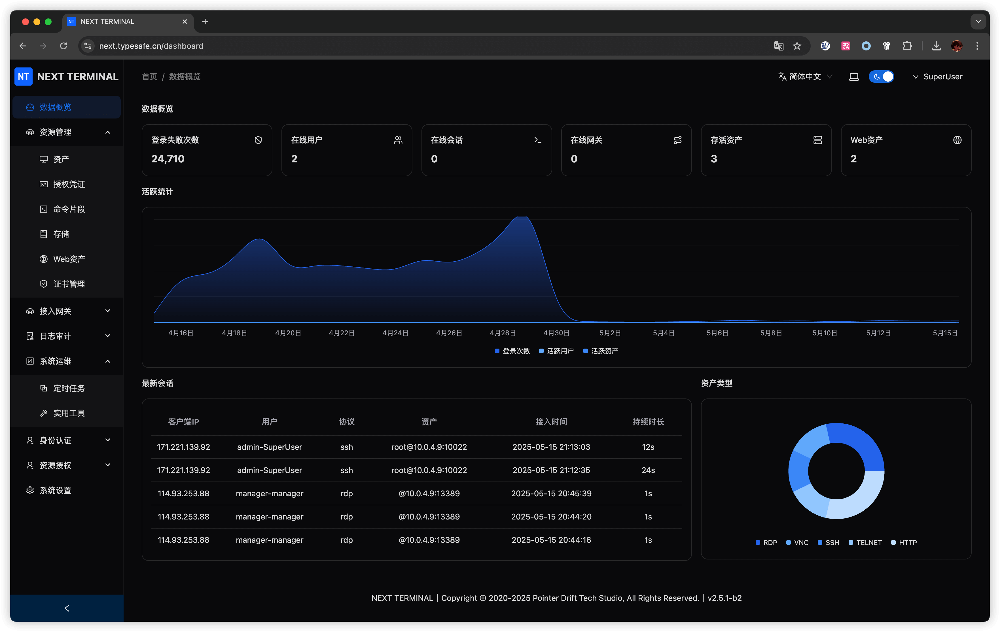
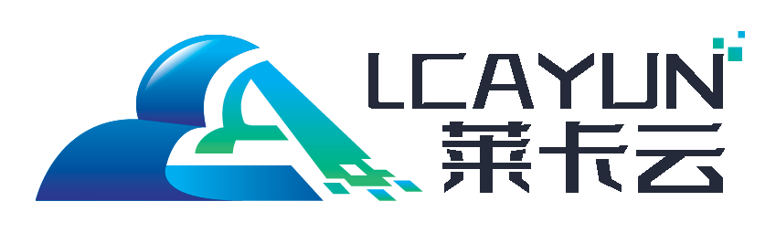

# Next Terminal

[English](./README-en.md) | 简体中文

提示：本项目从 v2.0.0 开始，后端代码不再开源。

----

## 简介

Next Terminal 是一个简洁、安全、易用的运维审计系统，支持多种远程访问协议，包括 RDP、SSH、VNC、Telnet、HTTP 等，适用于企业级运维场景。它可以记录和回放会话，协助安全审计与合规追踪。

## 快速安装

[👉 安装文档](https://docs.next-terminal.typesafe.cn)

## 屏幕截图

## 协议与条款

如您需要在企业网络中使用 next-terminal，建议先征求 IT 管理员的同意。下载、使用或分发 next-terminal 前，您必须同意 [协议](./LICENSE) 条款与限制。本项目不提供任何担保，亦不承担任何责任。

## 安全问题

如果您在使用过程中发现安全漏洞或潜在风险，请通过以下方式联系我们：

📧dushixiang@typesafe.cn

## 社群
- telegram https://t.me/next_terminal
- 微信群：加我微信备注「next-terminal」，拉你进群

## 赞助

- 本项目 CDN 加速及安全防护由 [Tencent EdgeOne](https://edgeone.ai/zh?from=github) 赞助

- **[SharonNetworks](https://sharon.io/)**

  亚太数据中心提供顶级的中国优化网络接入 · 低延时&高带宽&提供Tbps级本地清洗高防服务, 为您的业务保驾护航, 为您的客户提供极致体验.

- **[莱卡云-专业云计算服务器提供商](https://www.lcayun.com/actcloud.html?from=next-terminal)**

    

- **[Digitalvirt](https://digitalvirt.com/aff.php?aff=1326)** 提供安全可靠的弹性计算服务（优惠码 typesafe 全线云主机 八五折）

  

- **[Gomami](https://gomami.io/aff.php?aff=298)**  The Fastest China Route. The Strongest Performance.

  

## 优秀项目推荐

- [go-ldap-admin：基于Go+Vue实现的openLDAP后台管理项目](https://github.com/eryajf/go-ldap-admin)
