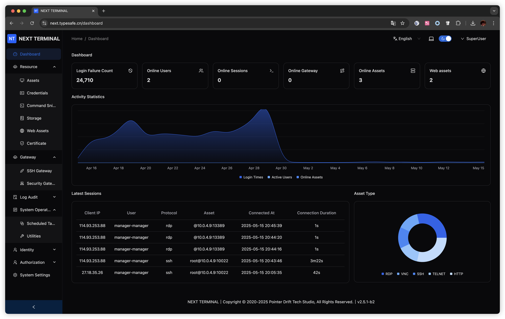
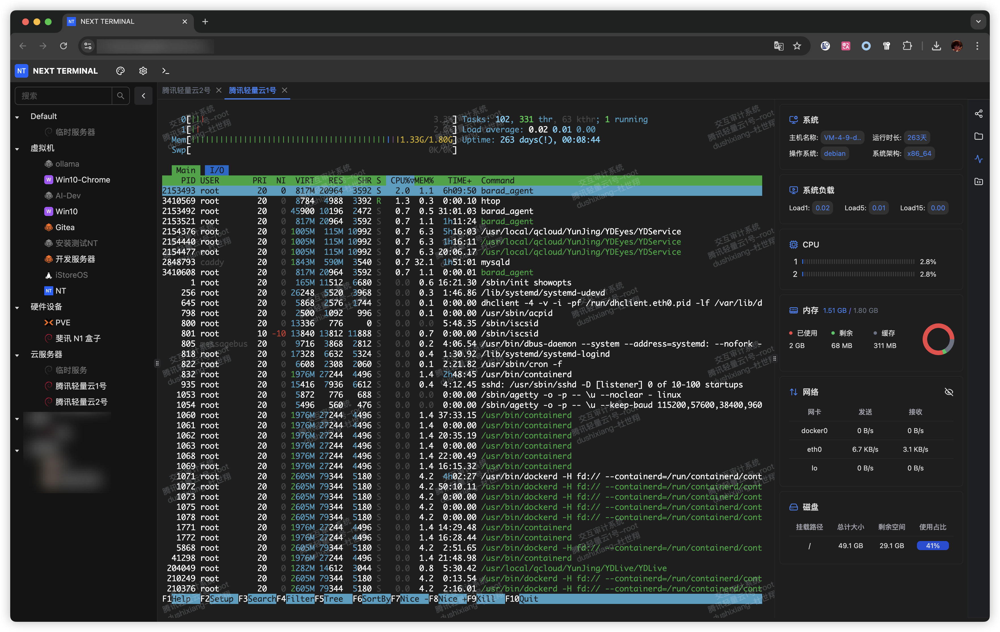

# Next Terminal

English | [简体中文](./README-zh_CN.md)

## Introduction

Next Terminal is a simple, secure, and user-friendly interactive auditing system that supports multiple remote access protocols including RDP, SSH, VNC, Telnet, and HTTP. It is designed for enterprise IT environments and helps facilitate session recording, audit tracking, and compliance reporting.

### Quick Start

Refer to the installation guide here:
👉 [Installation Documentation](https://docs.next-terminal.typesafe.cn)

## Screenshots

### License & Terms

Before downloading, using, or distributing Next Terminal, please read and agree to the [LICENSE](./LICENSE).
This project is provided "as is" without any warranties or guarantees. Use at your own risk.

⚠️ It is recommended to consult your **IT administrator** before deploying Next Terminal within a corporate network.

### Security Issues

If you discover any security vulnerabilities, please contact the maintainer:

📧 [dushixiang@typesafe.cn](mailto:dushixiang@typesafe.cn)

### Recommended Projects

* [go-ldap-admin](https://github.com/eryajf/go-ldap-admin): A web-based OpenLDAP management tool built with Go and Vue