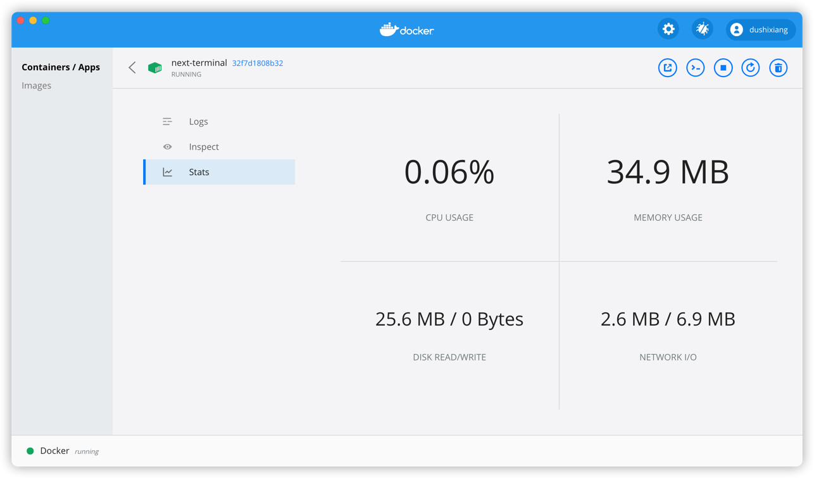
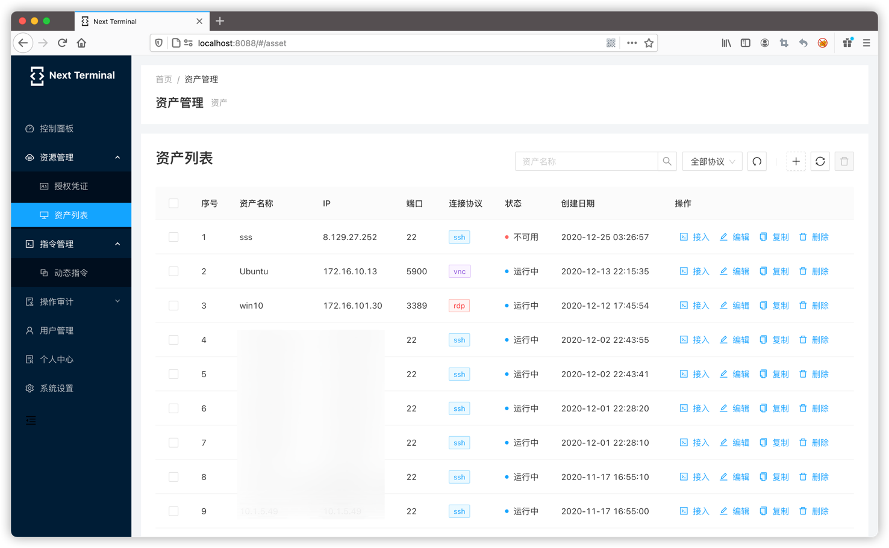
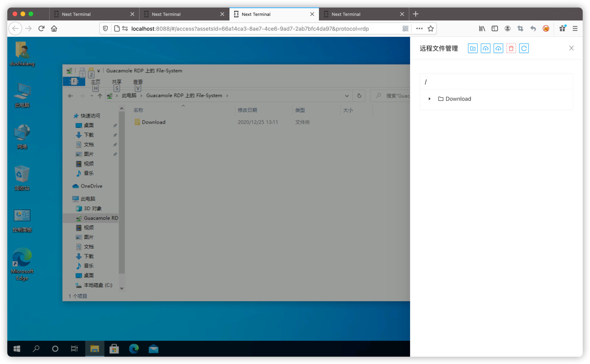
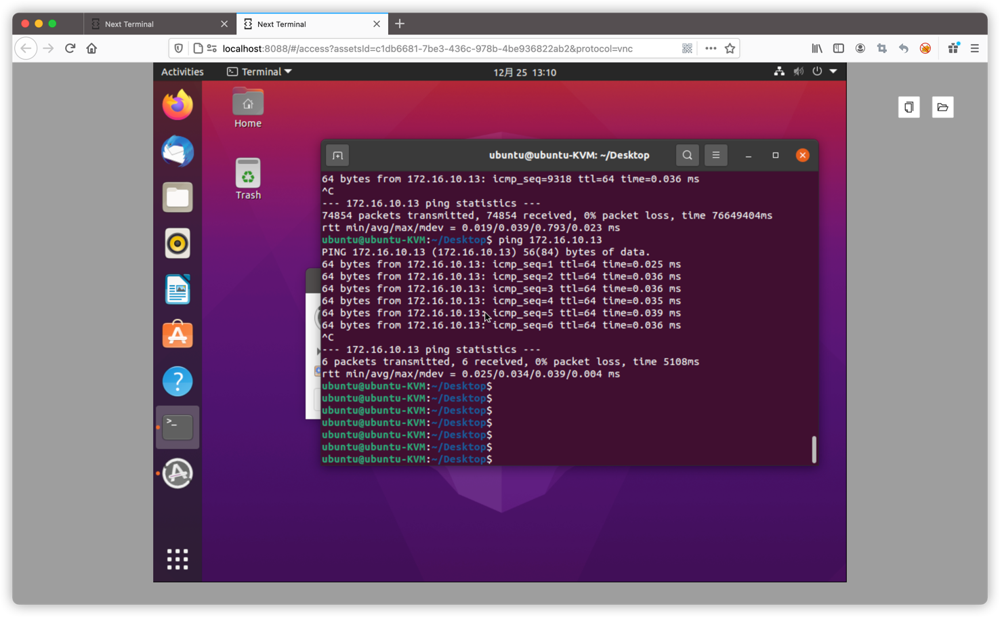
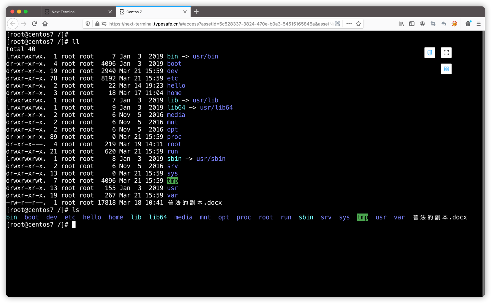
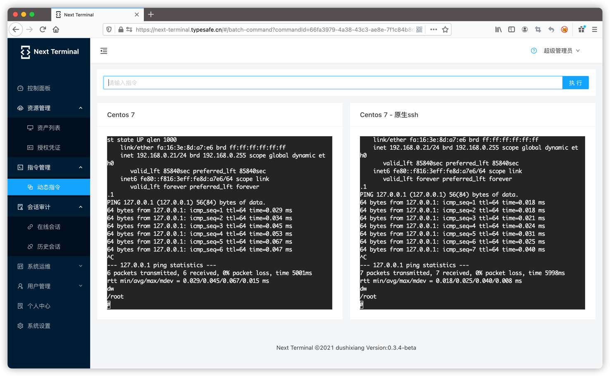

# Next Terminal

你的下一个终端。

## 快速了解

Next Terminal是使用Golang和React开发的一款HTML5的远程桌面网关，具有小巧、易安装、易使用、资源占用小的特点，支持RDP、SSH、VNC和Telnet协议的连接和管理。

Next Terminal基于 [Apache Guacamole](https://guacamole.apache.org/) 开发，使用到了guacd服务。

目前支持的功能有：

- 授权凭证管理
- 资产管理（支持RDP、SSH、VNC、TELNET协议）
- 指令管理
- 批量执行命令
- 在线会话管理（监控、强制断开）
- 离线会话管理（查看录屏）
- 双因素认证 感谢 [naiba](https://github.com/naiba) 贡献
- 资产标签
- 资产授权
- 用户分组

## 在线体验

https://next-terminal.typesafe.cn/

test/test

## 快速安装

- [使用docker安装](docs/install-docker.md)
- [原生安装](docs/install-naive.md)
- [FAQ](docs/faq.md)

默认账号密码为 admin/admin

## 相关截图

资源占用截图

资产管理

rdp

vnc

ssh

批量执行命令

## 联系方式

- 邮箱 helloworld1024@foxmail.com

- QQ群 938145268

  

- Telegram

  https://t.me/next_terminal