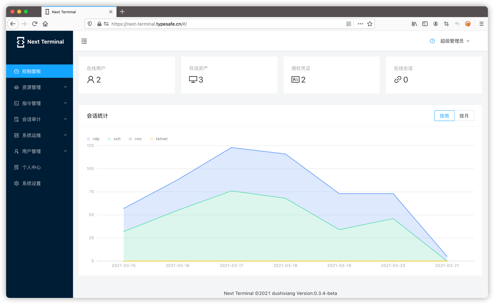
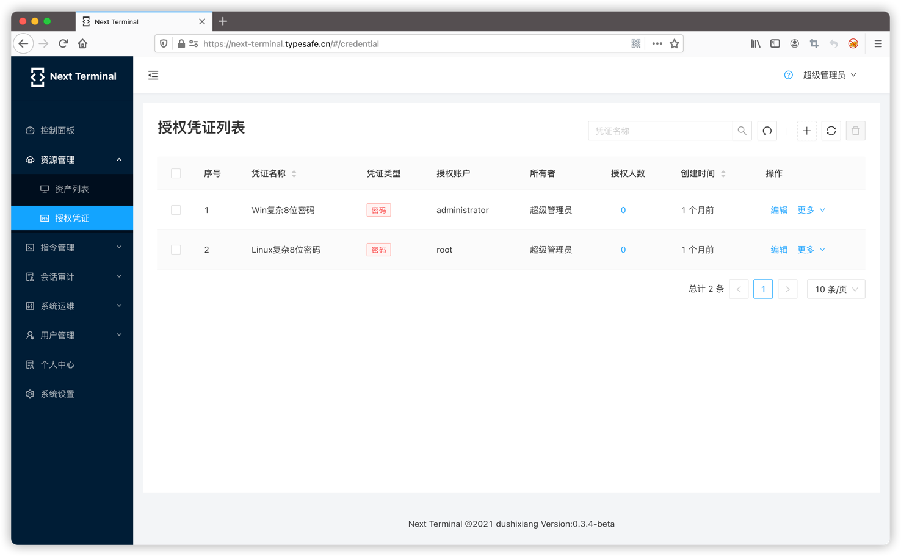
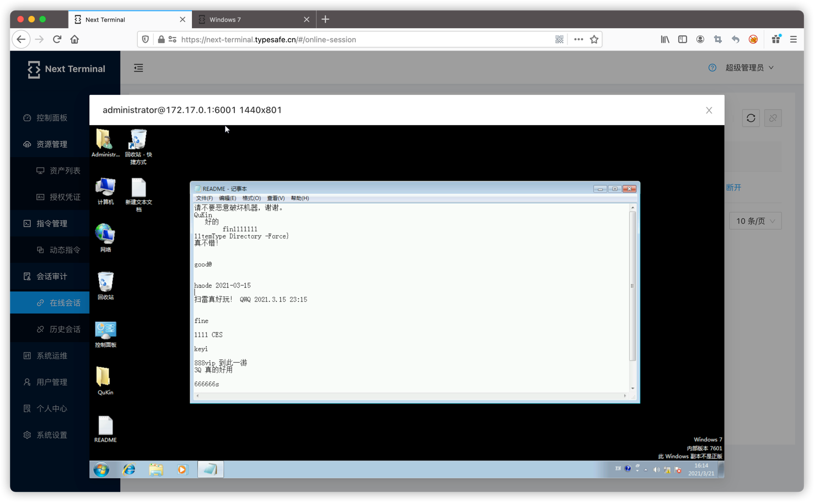
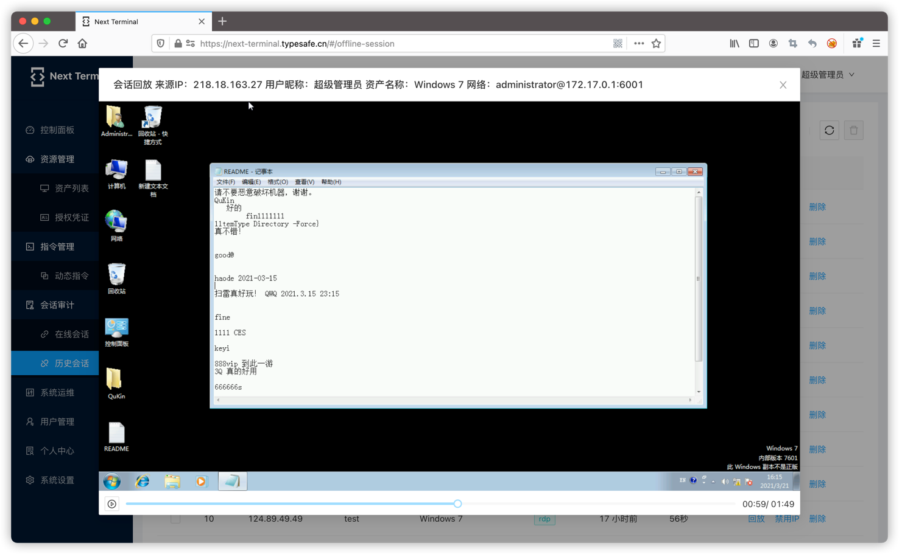
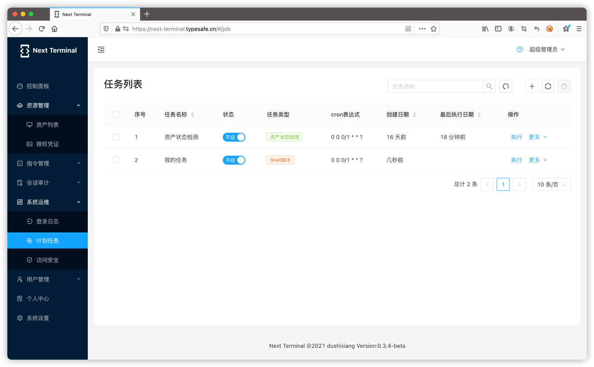
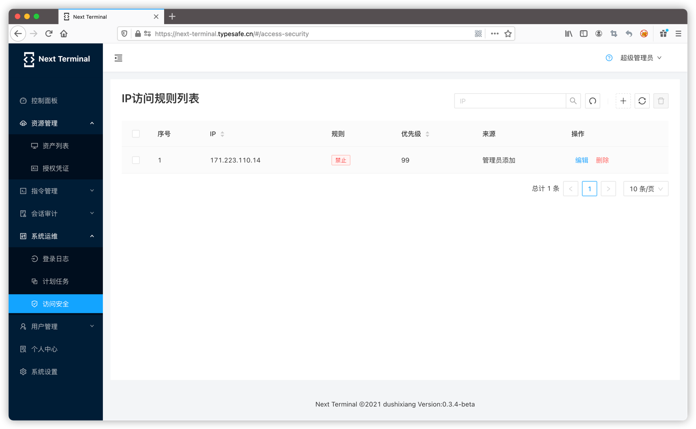
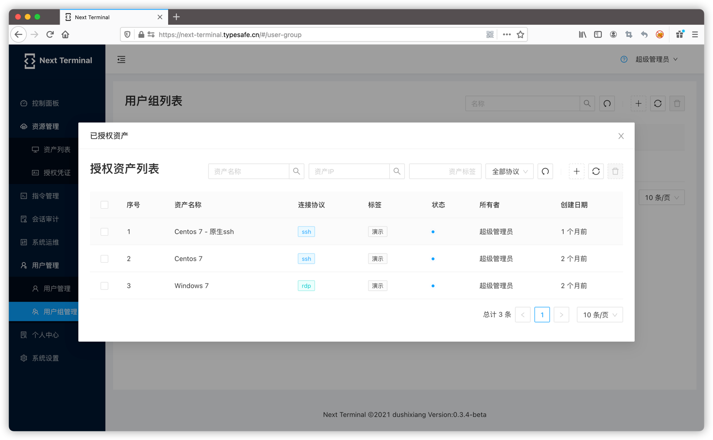

# Next Terminal

**注意：目前最后一个开源版是 0.5.0 版本，后续版本暂未开源。新版本 Docker 容器不再是 All in one 方式，拆分为了 guacd 和 next-terminal 两个容器。**

## 快速了解

Next Terminal是使用Golang和React开发的一款HTML5的远程桌面网关，具有小巧、易安装、易使用、资源占用小的特点，支持RDP、SSH、VNC和Telnet协议的连接和管理。

Next Terminal基于 [Apache Guacamole](https://guacamole.apache.org/) 开发，使用到了guacd服务。

目前支持的功能有：

- 授权凭证管理
- 资产管理（支持RDP、SSH、VNC、TELNET协议）
- 指令管理
- 批量执行命令
- 在线会话管理（监控、强制断开）
- 离线会话管理（查看录屏）
- 双因素认证
- 资产标签
- 资产授权
- 多用户&用户分组
- 计划任务

## 在线体验

https://next.typesafe.cn/

test/test

## 协议与条款

如您需要在企业网络中使用 next-terminal，建议先征求 IT 管理员的同意。下载、使用或分发 next-terminal 前，您必须同意 [协议](./LICENSE) 条款与限制。本项目不提供任何担保，亦不承担任何责任。

## 快速安装

- [安装文档](https://next-terminal.typesafe.cn/document/)

默认账号密码为 admin/admin

## 相关截图

### 资源占用

未使用时资源占用非常小

### 控制面板

更方便的概览系统信息

### 资产管理

支持多种RDP、SSH、Telnet、VNC，Kubernetes等多种协议的资产

#### rdp

#### vnc

#### ssh

### 授权凭证

极为方便的复用资产认证信息

批量执行命令

### 在线监控

实时监控用户的操作，并可以随时断开该会话

### 离线回放

详细的数据回放，定位任何一个可疑操作

### 计划任务

自定义计划任务

### 访问安全

黑白名单访问控制，支持ip、cidr及连续IP

### 用户组授权

灵活的授权策略

## 联系方式

- QQ群 938145268

- Telegram

  https://t.me/next_terminal